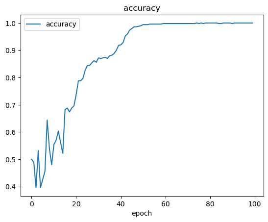

# Simple Deep Neural Network Model using Keras

## Objective 
- Project to implement the Tensorflow and Keras libraries to (supervise) train and test a multi layer neural network to classify a non-linear dataset into 2 discrete binary classes
- Dataset was produced using the Sklearn library 

## Method
- Similar method applied to that used in the [Simple Perceptron Model](https://github.com/sebdisiena/Simple-Perceptron-Model?tab=readme-ov-file) and [Simple Keras Perceptron Model](https://github.com/sebdisiena/Simple-Perceptron-Model-Keras) repositories
- Utilised Keras' Adam stochastic gradient descent model  
- Method utilises one input layer of 2 nodes, 1 hidden layer of 4 nodes and one output layer of one node to classify the dataset shown graphically below
  

  

## Results
- Accuracy of 1.0 after 100 epochs 
  

   
- Loss of 0.0382 after 100 epochs
  

  
- Effectively plotted regions for classification through contour plot
  

  
- Model was successful in classifying a random inputted data point into the correct class with 0.03394279 prediction
  

  